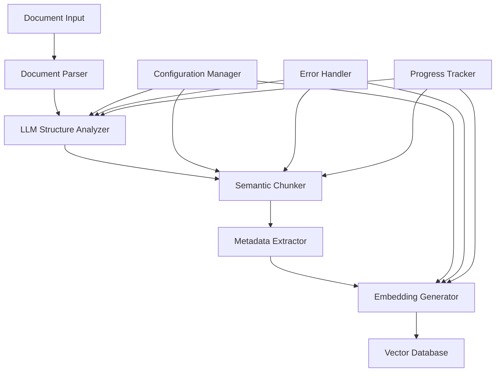

# Design Document

## Overview

The LLM-based chunker system will enhance the existing RAG pipeline by replacing the current HLM (Hierarchical Layout Model) approach with sophisticated AI-driven document analysis. The system will use Large Language Models to understand document semantics, create intelligent chunk boundaries, generate rich metadata, and produce high-quality embeddings for vector storage.

## Architecture

### High-Level Architecture



### Component Architecture

The system will be organized into the following main components:

1. **Document Parser**: Multi-format document content extraction
2. **LLM Structure Analyzer**: AI-powered document structure analysis
3. **Semantic Chunker**: Intelligent chunk boundary detection
4. **Metadata Extractor**: Rich metadata generation
5. **Embedding Generator**: High-quality vector embeddings
6. **Configuration Manager**: Flexible system configuration
7. **Error Handler**: Robust error handling and recovery
8. **Progress Tracker**: Processing monitoring and logging

## Components and Interfaces

### 1. Document Parser (`document_parser.py`)

**Purpose**: Extract raw content from various document formats while preserving structure information.

**Key Classes**:
- `DocumentParser`: Main parser interface
- `PDFParser`: PDF-specific parsing with layout detection
- `DocxParser`: Word document parsing with style information
- `TextParser`: Plain text and Markdown parsing
- `ExcelParser`: Spreadsheet parsing with sheet/cell structure

**Interface**:
```python
class DocumentParser:
    def parse(self, file_path: str) -> DocumentStructure:
        """Parse document and return structured content"""
        pass
    
    def get_supported_formats(self) -> List[str]:
        """Return list of supported file extensions"""
        pass

@dataclass
class DocumentStructure:
    content: str
    elements: List[DocumentElement]
    metadata: Dict[str, Any]
    
@dataclass
class DocumentElement:
    type: str  # header, paragraph, list, table, etc.
    content: str
    level: int
    position: int
    style_info: Dict[str, Any]
```

### 2. LLM Structure Analyzer (`llm_analyzer.py`)

**Purpose**: Use LLM to analyze document structure and identify semantic boundaries.

**Key Classes**:
- `LLMAnalyzer`: Main LLM interface for document analysis
- `StructurePromptManager`: Manages prompts for different analysis tasks
- `SemanticBoundaryDetector`: Identifies logical section boundaries

**Interface**:
```python
class LLMAnalyzer:
    def analyze_structure(self, document: DocumentStructure) -> StructureAnalysis:
        """Analyze document structure using LLM"""
        pass
    
    def identify_boundaries(self, content: str) -> List[BoundaryPoint]:
        """Find semantic boundaries in content"""
        pass

@dataclass
class StructureAnalysis:
    sections: List[SemanticSection]
    hierarchy: Dict[str, Any]
    topics: List[str]
    document_type: str

@dataclass
class SemanticSection:
    title: str
    content: str
    start_pos: int
    end_pos: int
    level: int
    topics: List[str]
    section_type: str
```

### 3. Semantic Chunker (`semantic_chunker.py`)

**Purpose**: Create intelligent chunks based on LLM analysis and configurable strategies.

**Key Classes**:
- `SemanticChunker`: Main chunking logic
- `ChunkingStrategy`: Abstract base for different chunking approaches
- `FixedSizeStrategy`: Traditional fixed-size chunking with semantic awareness
- `SemanticStrategy`: Pure semantic boundary-based chunking
- `HybridStrategy`: Combination of size and semantic constraints

**Interface**:
```python
class SemanticChunker:
    def chunk_document(self, analysis: StructureAnalysis, strategy: ChunkingStrategy) -> List[SemanticChunk]:
        """Create chunks based on structure analysis"""
        pass

@dataclass
class SemanticChunk:
    title: str
    content: str
    metadata: ChunkMetadata
    position: ChunkPosition
    
@dataclass
class ChunkMetadata:
    topics: List[str]
    section_type: str
    document_type: str
    quality_score: float
    source_file: str
    
@dataclass
class ChunkPosition:
    chunk_index: int
    total_chunks: int
    start_pos: int
    end_pos: int
    parent_section: str
```

### 4. Metadata Extractor (`metadata_extractor.py`)

**Purpose**: Generate rich metadata for each chunk using LLM analysis.

**Key Classes**:
- `MetadataExtractor`: Main metadata generation
- `TopicExtractor`: Extract key topics and themes
- `SummaryGenerator`: Generate chunk summaries
- `CategoryClassifier`: Classify content categories

**Interface**:
```python
class MetadataExtractor:
    def extract_metadata(self, chunk: SemanticChunk) -> EnrichedMetadata:
        """Generate comprehensive metadata for chunk"""
        pass

@dataclass
class EnrichedMetadata:
    summary: str
    keywords: List[str]
    topics: List[str]
    category: str
    complexity_level: str
    language: str
    entities: List[str]
    relationships: List[str]
```

### 5. Embedding Generator (`embedding_generator.py`)

**Purpose**: Generate high-quality embeddings optimized for semantic search.

**Key Classes**:
- `EmbeddingGenerator`: Main embedding generation
- `ModelManager`: Manage different embedding models
- `TextPreprocessor`: Optimize text for embedding
- `EmbeddingOptimizer`: Enhance embeddings with metadata

**Interface**:
```python
class EmbeddingGenerator:
    def generate_embedding(self, chunk: SemanticChunk) -> np.ndarray:
        """Generate optimized embedding for chunk"""
        pass
    
    def batch_generate(self, chunks: List[SemanticChunk]) -> List[np.ndarray]:
        """Generate embeddings in batches for efficiency"""
        pass
```

### 6. Configuration Manager (`config_manager.py`)

**Purpose**: Manage system configuration and chunking strategies.

**Key Classes**:
- `ConfigManager`: Main configuration management
- `ChunkingConfig`: Chunking-specific settings
- `LLMConfig`: LLM model and prompt settings
- `EmbeddingConfig`: Embedding model settings

## Data Models

### Database Schema Enhancement

The existing database schema will be enhanced to support rich metadata:

```sql
-- Enhanced documents table
ALTER TABLE documents ADD COLUMN IF NOT EXISTS chunk_title VARCHAR(500);
ALTER TABLE documents ADD COLUMN IF NOT EXISTS topics TEXT[];
ALTER TABLE documents ADD COLUMN IF NOT EXISTS section_type VARCHAR(100);
ALTER TABLE documents ADD COLUMN IF NOT EXISTS document_type VARCHAR(100);
ALTER TABLE documents ADD COLUMN IF NOT EXISTS quality_score FLOAT;
ALTER TABLE documents ADD COLUMN IF NOT EXISTS summary TEXT;
ALTER TABLE documents ADD COLUMN IF NOT EXISTS keywords TEXT[];
ALTER TABLE documents ADD COLUMN IF NOT EXISTS complexity_level VARCHAR(50);
ALTER TABLE documents ADD COLUMN IF NOT EXISTS language VARCHAR(10);
ALTER TABLE documents ADD COLUMN IF NOT EXISTS parent_section VARCHAR(500);

-- New table for chunk relationships
CREATE TABLE IF NOT EXISTS chunk_relationships (
    id SERIAL PRIMARY KEY,
    source_chunk_id INTEGER REFERENCES documents(id),
    target_chunk_id INTEGER REFERENCES documents(id),
    relationship_type VARCHAR(100),
    strength FLOAT,
    created_at TIMESTAMP DEFAULT CURRENT_TIMESTAMP
);

-- New table for processing logs
CREATE TABLE IF NOT EXISTS processing_logs (
    id SERIAL PRIMARY KEY,
    file_name VARCHAR(500),
    processing_stage VARCHAR(100),
    status VARCHAR(50),
    duration_seconds FLOAT,
    error_message TEXT,
    metadata JSONB,
    created_at TIMESTAMP DEFAULT CURRENT_TIMESTAMP
);
```

## Error Handling

### Error Recovery Strategy

1. **LLM Failure Recovery**: If LLM analysis fails, fall back to rule-based structure detection
2. **Chunking Fallback**: If semantic chunking fails, use fixed-size chunking with overlap
3. **Embedding Fallback**: If advanced embedding fails, use basic sentence transformer
4. **Partial Processing**: Allow partial document processing with error logging
5. **Retry Logic**: Implement exponential backoff for transient failures

### Error Types and Handling

```python
class ChunkingError(Exception):
    """Base exception for chunking errors"""
    pass

class LLMAnalysisError(ChunkingError):
    """LLM analysis failed"""
    pass

class EmbeddingGenerationError(ChunkingError):
    """Embedding generation failed"""
    pass

class DocumentParsingError(ChunkingError):
    """Document parsing failed"""
    pass
```

## Testing Strategy

### Unit Testing
- Test each component independently with mock data
- Test error handling and edge cases
- Test configuration management
- Test different chunking strategies

### Integration Testing
- Test end-to-end document processing pipeline
- Test database integration
- Test LLM integration with different models
- Test performance with various document sizes

### Performance Testing
- Benchmark processing speed for different document types
- Test memory usage with large documents
- Test concurrent processing capabilities
- Measure embedding quality metrics

### Quality Assurance
- Validate chunk coherence and semantic quality
- Test retrieval accuracy with generated chunks
- Compare performance against baseline HLM system
- Validate metadata accuracy and completeness

## Performance Considerations

### Optimization Strategies

1. **Batch Processing**: Process multiple documents in parallel
2. **Caching**: Cache LLM analysis results for similar document structures
3. **Streaming**: Stream large documents to avoid memory issues
4. **Model Optimization**: Use quantized models for faster inference
5. **Database Optimization**: Use proper indexing for vector searches

### Scalability

1. **Horizontal Scaling**: Support distributed processing across multiple workers
2. **Queue Management**: Use task queues for asynchronous processing
3. **Resource Management**: Monitor and limit resource usage per task
4. **Load Balancing**: Distribute LLM requests across multiple endpoints

## Security Considerations

1. **Input Validation**: Validate all document inputs and configurations
2. **LLM Safety**: Implement content filtering for LLM inputs/outputs
3. **Data Privacy**: Ensure sensitive document content is handled securely
4. **Access Control**: Implement proper authentication for API endpoints
5. **Audit Logging**: Log all processing activities for security monitoring